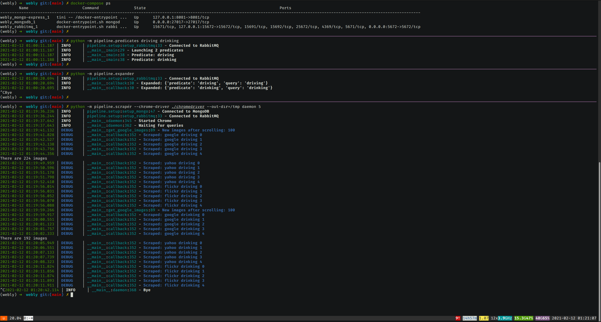

# Scraping Pipeline

1. Create folder `.secrets` and setup MongoDB, RabbitMQ, and Chrome credentials:
   ```bash
   cp -r .secrets_example .secrets 
   ```

2. Start all containers:
   ```bash
   docker-compose up -d
   docker-compose ps
   ```

3. Launch a process to generate predicates
   ```bash
   export RABBITMQ_DEFAULT_USER_FILE=.secrets/rabbitmq_default_user_file
   export RABBITMQ_DEFAULT_PASS_FILE=.secrets/rabbitmq_default_pass_file
   python -m pipeline.predicates 'path/to/predicates.txt' 'some pred' 'another pred'
   ```

3. Launch one or more of the expander processes:
   ```bash
   export RABBITMQ_DEFAULT_USER_FILE=.secrets/rabbitmq_default_user_file
   export RABBITMQ_DEFAULT_PASS_FILE=.secrets/rabbitmq_default_pass_file                                                                        
   python -m pipeline.expander
   ```

4. Launch one or more scraper processes:
   ```bash
   export RABBITMQ_DEFAULT_USER_FILE=.secrets/rabbitmq_default_user_file
   export RABBITMQ_DEFAULT_PASS_FILE=.secrets/rabbitmq_default_pass_file
   export MONGO_INITDB_ROOT_USERNAME_FILE=.secrets/mongo_initdb_root_username
   export MONGO_INITDB_ROOT_PASSWORD_FILE=.secrets/mongo_initdb_root_password
   source .secrets/chrome_token && export TOKEN
   python -m pipeline.scraper --chrome 'http://localhost:3000/webdriver' daemon 40
   ```
   
5. Kill expander and scraper processes, then stop containers:
   ```bash
   docker-compose stop
   ```



Monitoring:
- [RabbitMQ queues](http://localhost:15672/)
- [MongoDB documents](http://localhost:8081/)

Test queries manually:
```bash
python -m pipeline.scraper manual google driving 100
```